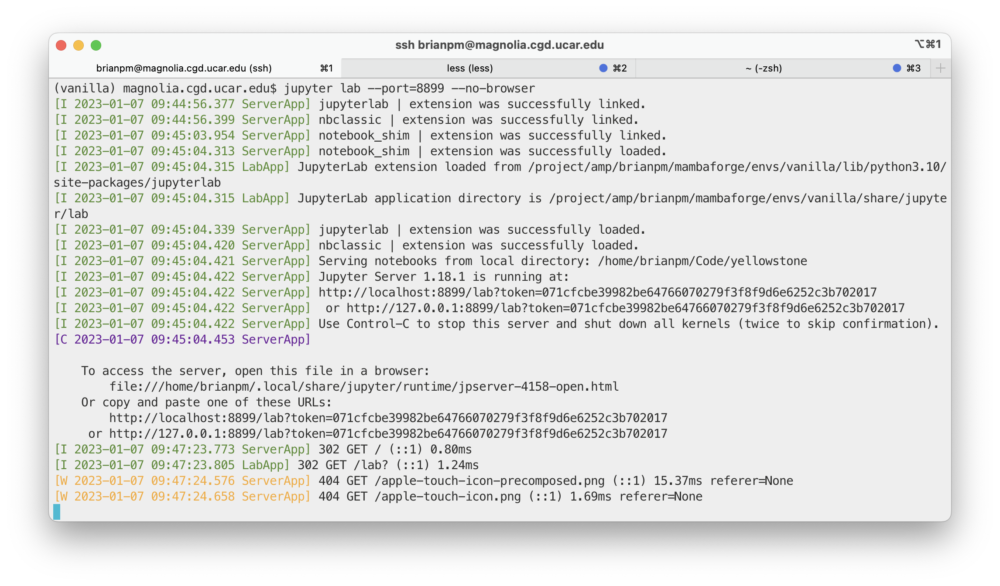

# How I open jupyter on CGD machines


## Prerequisite: 
- working conda (or mamba) environment(s) on CGD systems.
- environment(s) need to have jupyter server libraries installed

## Set up

The steps are simple:
- If remote: start VPN
- SSH to one of the CGD servers (magnolia, topaz, andre, etc.)
- activate the environment you want to be using
- go to your code repository/directory
- start jupyter server
- from your computer, open ssh tunnel to the server
- open jupyter in your local browser

A detailed example:

```
ssh yourusername@cgdservername.cgd.ucar.edu
conda activate your_environment
cd /your/code/repository
jupyter lab --port=8899 --no-browser
```

Back on your local machine:
```
ssh -N -f -L 8899:localhost:8899 yourusername@cgdservername.cgd.ucar.edu
```
_Note:_ the default port that Jupyter wants to use is 8888, but I often found that port was already being used on one machine or the other, so I just arbitrarily changed to 8899. 

Go to browser and enter into the address bar:
```
localhost:8899
```

You will likely get an authentication page:

In this case, go back to your original ssh session in the first terminal window (where you started the jupyter server). It'll look something like:


Copy the token string and put it into the browser field.

That should authenticate you, and jupyter lab will open. At this point, leave those **two terminal sessions open** and interact with jupyter through the browser. 

## Shutting Down

When you are done, the shutdown procedure is easy. 
- In the browser, in the jupyter interface go to "File" and at the bottom select "Log Out" or "Shut Down"
- If you select "Log Out" that does not shut down the server, and you can log back into it.
- If you select "Shut Down" that should log you out and also shut down the server.
- At any time, you can shut down the server by going to your first session and pressing `Ctrl+C`, and then enter "y" when asked if you really want to shut down the server. You can also hit `Ctrl+C` again, and I think it'll shut down.
- To close that ssh tunnel, go back to any local terminal and run `ps aux | grep <port number>` to identify the process ID, and then run `kill -9 [PID]`